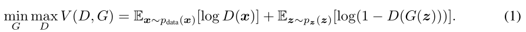
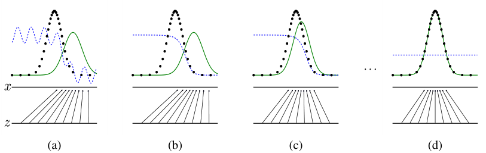
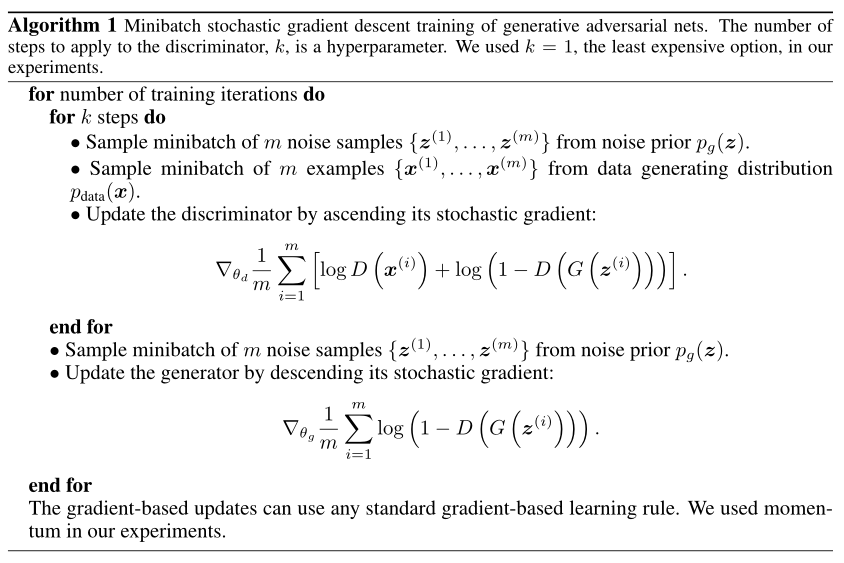
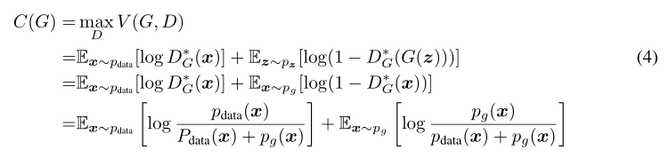
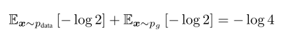
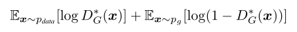
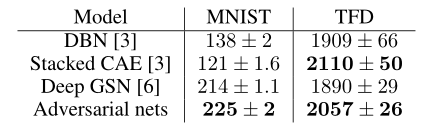
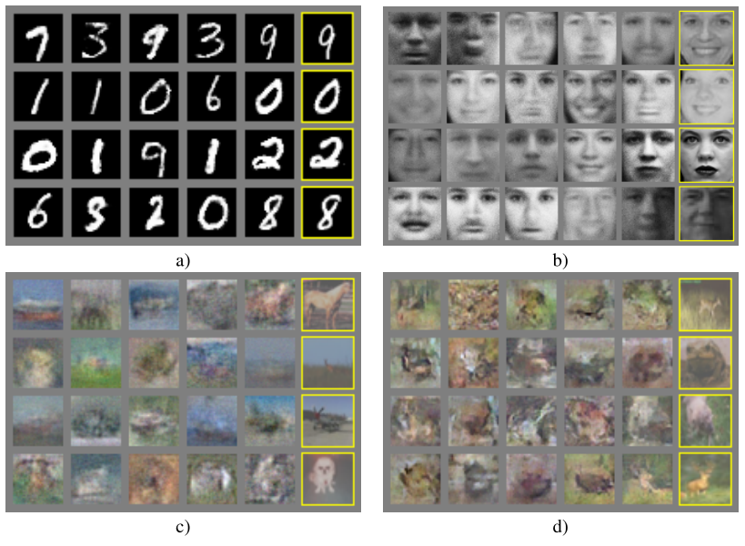
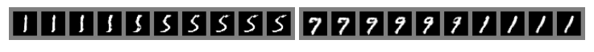
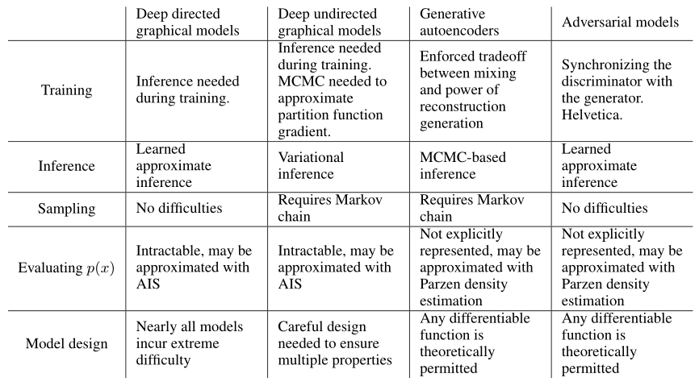

# Generative Adversarial Nets

Ian J. Goodfellow, Jean Pouget-Abadie∗, Mehdi Mirza, Bing Xu, David Warde-Farley,
Sherjil Ozair†, Aaron Courville, Yoshua Bengio‡
Département d’informatique et de recherche opérationnelle
Université de Montréal
Montréal, QC H3C 3J7

## 摘要

我们提出了一个通过对抗过程估计生成模型的新框架，在这个框架中，我们同时训练两个模型:生成模型G捕获数据分布，判别模型D估计样本来自于训练数据而不是G的概率。G的训练过程是最大限度地提高D出错的概率。这个框架对应于一个极大极小的双人博弈。在任意函数G和D的空间中，存在一个唯一解，G恢复训练数据分布，D处处等于1/2。在G和D由多层感知器定义的情况下，整个系统可以用反向传播进行训练。在样本的训练和生成过程中，不需要任何马尔可夫链或展开的近似推理网络。通过对生成的样本进行定性和定量评估，实验证明了该框架的潜力。

## 1 Introduction

​		深度学习的前景是发现丰富的分层模型[2]，该模型表示人工智能应用中遇到的各种数据的概率分布，如自然图像、包含语音的音频波形和自然语言语料库中的符号。到目前为止，深度学习中最显著的成功涉及到判别模型，通常是那些将高维、丰富的感官输入映射到类别标签的模型[14,22]。这些显著的成功主要是基于反向传播和dropout（丢弃）算法，使用分段线性单元[19,9,10]，它们具有特别良好的梯度。深层生成模型的影响较小，因为难以逼近在最大似然估计和相关策略中产生的许多棘手的概率计算，也因为难以在生成环境中利用分段线性单元的好处。我们提出了一种新的生成模型评估程序，以避免这些困难。

​		在提出的对抗网框架中，生成模型与对手相对抗:一个**判别模型**，学习确定样本是来自模型分布还是来自数据分布。**生成模型**可以被认为类似于一组伪造者，他们试图制造假币并在不被发现的情况下使用它，而判别模型则类似于警察，他们试图发现假币。在这个游戏中的竞争驱使两队改进他们的方法，直到假货与正品无法区分。

ps：猫鼠游戏？

​		该框架可以为多种模型和优化算法生成特定的训练算法。在本文中，我们探讨了生成模型通过一个多层感知器传递随机噪声来生成样本的特殊情况，而判别模型也是一个多层感知器。我们将这种特殊情况称为对抗网。在这种情况下，我们可以只使用非常成功的backpropagation和dropout算法[17]来训练这两个模型，而只使用forward  propagation来训练生成模型的样本。不需要近似推理或马尔可夫链。

ps：backpropagation是反向传播，dropout是丢弃法，forward propagation是前向传播

## 2 Related work

​		具有潜在变量的有向图形模型的另一种选择是具有潜在变量的无向图形模型，如受限玻尔兹曼机(RBMs)[27,16]、深度玻尔兹曼机(DBMs)[26]及其众多变体。这些模型中的相互作用被表示为非归一化势函数的乘积，归一化的方法是对随机变量的所有状态进行全局求和/积分。这个量(配分函数)及其梯度对于除了最琐碎的情况之外的所有情况都是难以处理的，尽管它们可以用马尔可夫链蒙特卡罗(MCMC)方法来估计。混合给依赖于MCMC的学习算法带来了一个重大问题[3,5]。

​		深度置信网络(DBNs)[16]是包含一个无向层和几个有向层的混合模型。虽然存在快速近似的分层训练准则，但DBNs与无向模型和有向模型都存在计算困难。

​		也提出了不近似或限制对数似然的替代标准，如分数匹配[18]和噪声对比估计(NCE)[13]。这两种方法都要求学习到的概率密度被解析地指定为一个标准化常数。请注意，在许多具有多层潜在变量(如DBNs和DBMs)的有趣生成模型中，甚至不可能导出可处理的非标准化概率密度。一些模型，如去噪自动编码器[30]和收缩自动编码器，其学习规则与应用于RBMs的分数匹配非常相似。在NCE中，就像在这项工作中一样，一个判别训练标准被用来适应生成模型。然而，生成模型本身被用来从固定噪声分布的样本中区分生成的数据，而不是拟合一个单独的判别模型。因为NCE使用了固定的噪声分布，所以当模型在观察变量的一小部分上学习到一个近似正确的分布后，学习速度会显著减慢。

​		最后，有些技术不涉及明确定义概率分布，而是训练生成机器从期望的分布中提取样本。这种方法的优点是这样的机器可以被设计成通过反向传播进行训练。最近在这一领域的突出工作包括生成随机网络(GSN)框架[5]，它扩展了广义降噪自编码器[4]:两者都可以被视为定义了一个参数化的马尔可夫链，也就是说，一个人可以学习执行生成马尔可夫链的一个步骤的机器的参数。与GSNs相比，对抗网框架不需要马尔可夫链进行采样。由于对抗网络在生成过程中不需要反馈循环，它们能够更好地利用分段线性单元[19,9,10]，这提高了反向传播的性能，但在使用反馈循环时存在无界激活的问题。最近通过反向传播来训练生成机的例子包括最近关于自编码变分贝叶斯[20]和随机反向传播[24]的研究。

## 3 Adversarial nets（对抗网络）

​		当模型都是多层感知器时，对抗建模框架是最直接适用的。为了了解发生器在数据x上的分布p~g~，我们定义一个先验的输入噪声变量p~z~  (z)，然后将一个到数据空间的映射表示为G(z;θ~g~)，其中G是一个可微函数，由一个参数为θ~g~的多层感知器表示。我们还定义了输出单个标量的第二个多层感知器D(x;θ~d~)。D(x)表示x来自数据而不是p~g~的概率。我们训练D，使G的训练样本和样本都得到正确标签的概率最大化。我们同时训练G，使log(1−D(G(z))最小:

​		换句话说，D和G用值函数V  (G, D)进行了如下的两人极小极大博弈:

​		在下一节中，我们提出了对抗网的理论分析，本质上表明当G和D有足够的容量时，即在非参数极限下，训练准则允许人们恢复数据生成分布。图1给出了对该方法不太正式的、更多的教学解释。实际上，我们必须使用迭代和数值方法来执行游戏。在训练的内环中优化D到完成在计算上是禁止的，并且有限的数据集会导致过拟合。相反，我们在优化D的k步和优化G的1步之间交替进行，这导致D保持在最优解附近，只要G的变化足够缓慢。这种策略类似于SML/PCD[31,29]训练的方式，从一个学习步骤到下一个学习步骤，保持马尔可夫链中的样本，以避免马尔可夫链作为学习内部循环的一部分被烧毁。该过程在算法1中正式给出。

​		在实践中，方程1可能不能提供足够的梯度让G学习得更好。在学习早期，当G较差时，D可以拒绝高可信度的样本，因为这些样本与训练数据明显不同。此时，log(1−D(G(z)))饱和。与其训练G最小化log(1−D(G(z)))，不如训练G最大化log  D(G(z))。这个目标函数使G和D的动态具有相同的不动点，但在学习早期提供了更强的梯度。

**图1**:生成式对抗网是通过同时更新判别分布(D，蓝色，虚线)来训练的，这样它就可以区分生成分布(黑色，虚线)p~x~和生成分布p~g~  (G)(绿色，实线)的样本。下面的水平线是z被采样的区域，在这种情况下是均匀的。上面的水平线是x的域的一部分。向上的箭头显示了映射x =  G(z)是如何将非均匀分布p~g~强加到转换样本上的。G在高密度区域收缩，在低密度区域扩张。(a)考虑一个接近收敛的对抗对:p~g~类似于p~data~,  D是一个部分准确的分类器。(b)在算法D的内部循环中，训练它从数据中区分样本，收敛到D∗(x) = p~data~ (x) p~data~ (x)+p~g~ (x)。(c)  G更新后，D的梯度引导G(z)流向更可能被归类为数据的区域。(d)经过几个步骤的训练，如果G和d有足够的能力，他们会达到一个点，两者都不能提高，因为p~g~ =  p~data~。鉴别器无法区分两个分布，即D(x) = 1 2。

## 4 Theoretical Results（理论结果）

​		产生器G隐式地定义了一个概率分布p~g~作为当z  ~  p~z~时得到的样本G(z)的分布。因此，如果有足够的容量和训练时间，我们希望算法1收敛到一个好的p~data~估计。本节的结果是在非参数设置中完成的，例如，我们通过研究概率密度函数空间中的收敛来表示一个具有无限容量的模型

​		我们将在4.1节中展示这个极大极小博弈对于p~g~ = p~data~具有全局最优。我们将在4.2节中展示，算法1优化了Eq 1，从而得到了预期的结果。

### 4.1 Global Optimality of P~g~ = p~data~(P~g~ = p~data~的全局最优性)

我们首先考虑对任意给定的产生器 **G** 的最优鉴别器 **D** 。

**命题1**. 对于**G~fixed~**，最优鉴别器**D**为
$$
D^*_G(x) = \frac{p_{data}(x)}{p_{data}(x)+p_g(x)}\tag{2}
$$
**证明**. 对于任意发生器G，判别器D的训练准则是使量V  (G, D)最大化
$$
V(G,D)=\int_x p_{data}(x)log(D(x))dx + \int_z p_z(z)log(1-D(g(z)))dz\\
=\int_xp_{data}(x)log(D(x))+p_g(x)log(1-D(x))dx\tag{3}
$$
对于任意(a, b)∈R^2^ \{0,0}，函数y→a log(y) +b log(1−y)在a  a+b处在[0,1]达到最大值。鉴别器不需要在Supp(p~data~)∪Supp(p~g~)之外定义，从而完成证明。

注意,培养目标为D可以解释为最大化对数似估计条件概率P  (Y = Y | x), Y表示是否x来自哪里p~data~ (Y = 1)或从p~g~ (Y = 0)。Eq.1中的极大极小的游戏现在可以新推导为:

**定理1.** 当且仅当p~g~  = p~data~时，得到虚拟训练准则C (G)的全局最小值。此时，C (G)得到−log 4。

**证明.** 对于p~g~  = p~data~, D∗G(x) = 1/2，(考虑等式2)。因此，通过在D∗G(x) = 1 2考察等式4，我们发现C (G) = log 1/2 + log  1/2 =−log 4。为了看到这是C (G)的最佳可能值，只在p~g~ = p~data~时才达到，观察一下

​		通过从C  (G) = V (D∗G, G)中减去这个表达式，我们得到:
$$
C(G) = -log(4)+KL(p_{data}||\frac{p_{data}+p_g}{2})+KL(p_g||\frac{p_{data}+p_g}{2})\tag{5}
$$
​		KL是Kullback-Leibler的分流。在前面的表达式中，我们认识到模型分布与数据生成过程之间的Jensen  - Shannon散度:
$$
C(G) = -log(4)+2\cdot JSD(p_{data}||p_g)\tag{6}
$$
​		自从Jensen-Shannon两个分布之间的分歧总是非负和零只有当他们是相等的,我们已经表明,C∗=−日志(4)是全球最低的C (G),唯一的解决办法是p~g~  = p~data~,即生成模型完全复制数据生成过程。

### 4.2 Convergence of Algorithm 1(算法1的收敛性)

**命题2.** 如果G和D有足够的容量，在算法1的每一步中，允许鉴别器在给定G时达到其最优，并更新p~g~以改进判据

然后p~g~收敛到p~data~

**证明.** 将V (G, D) = U (p~g~, D)作为p~g~的函数，如上述准则所示。注意U (p~g~,  D)在p~g~上是凸形的。凸函数的上界的次导数包括该函数在达到最大值点处的导数。换句话说，如果f (x) = supα∈A  fα(x)并且fα(x)对每个α都是x上的凸，那么∂fβ (x)∈∂f如果β = arg sup~α∈A~  f~α~(x)。这相当于计算梯度下降法更新p~g~在最优D给定相应的g . sup~D~ U (p~g~,  D)是凸在p~g~与一个独特的全球最适条件证明定理1,因此与p~g~的足够小更新,p~g~收敛于px,结论证明。

在实践中，对抗网通过函数G(z;θg)表示有限家族的p~g~分布，我们优化θ~g~而不是p~g~本身。使用多层感知器定义G在参数空间中引入多个临界点。然而，多层感知器在实践中的优异性能表明，尽管缺乏理论保障，但它们是一个可以使用的合理模型。

## 5 Experiments(实验)

​		我们训练对抗网的一系列数据集，包括MNIST[23]、多伦多面部数据库(TFD)[28]和CIFAR-10[21]。发电机网使用整流线性激活[19,9]和sigmoid激活的混合，而鉴别器网使用maxout[10]激活。采用Dropout[17]算法对鉴别器网进行训练。虽然我们的理论框架允许在发生器的中间层使用dropout和其他噪声，但我们只使用噪声作为发生器网络最底层的输入。

​		我们通过对G生成的样本拟合一个高斯Parzen窗口来估计pg下测试集数据的概率，并报告该分布下的对数似然。σ参数

**表1:**基于Parzen窗口的对数似然估计。在MNIST上报告的数字是测试集上样本的平均对数似然，在不同的示例中计算出平均的标准误差。在TFD上，我们计算了跨数据集的折叠的标准误差，使用每个折叠的验证集选择不同的σ。在TFD上，对每个褶皱进行σ交叉验证，计算出每个褶皱的平均对数似然。对于MNIST，我们比较了数据集的实值(而不是二进制)版本的其他模型。

​		通过对验证集的交叉验证得到。该程序是在Breuleux等人的[8]中引入的，用于精确似然性难以处理的各种生成模型[25,3,5]。结果见表1。这种估计似然的方法有较高的方差，在高维空间中不能很好地执行，但它是我们已知的最好的方法。生成模型的发展，可以抽样但不能估计可能性，直接推动进一步研究如何评估这些模型。

​		在图2和图3中，我们展示了训练后从生成器网络中抽取的样本。虽然我们没有声称这些样本比现有方法生成的样本更好，但我们相信这些样本至少与文献中更好的生成模型竞争，并突出了对抗框架的潜力。

图2:模型中样本的可视化。最右边的一列显示了邻近样本的最近的训练例子，以证明模型没有记住训练集。样本是公平随机抽取的，不是精心挑选的。与大多数其他深层生成模型的可视化不同，这些图像显示的是来自模型分布的实际样本，而不是隐含单位样本的条件平均值。此外，由于采样过程不依赖于马尔可夫链混合，这些样本是不相关的。a)  MNIST b) TFD c) CIFAR-10(全连接模型)d) CIFAR-10(卷积鉴别器和“反卷积”发生器)

**图3:**全模型z空间坐标之间线性插值得到的数字

**表2:**生成建模面临的挑战:总结了在涉及模型的每一个主要操作中，不同的深度生成建模方法所遇到的困难。

## 6 Advantages and disadvantages（优点和缺点）

​		与以前的建模框架相比，这个新框架既有优点也有缺点。缺点主要是p~g~  (x)没有显式表示，训练时D必须与G保持良好的同步(特别是G不能训练过多而不更新D，为了避免“Helvetica场景”，即G折叠太多的z值到相同的x值，从而有足够的多样性来建模p~data~)，就像玻尔兹曼机器的负链必须在学习步骤之间保持最新。其优点是不需要马尔可夫链，只使用背支撑来获取梯度，在学习过程中不需要推理，可以将各种各样的函数合并到模型中。表2总结了生成式对抗网与其他生成式建模方法的比较。

​		上述优点主要是计算方面的。对抗模型也可以从生成器网络中获得一些统计优势，这些生成器网络不直接使用数据示例进行更新，而只使用通过鉴别器的梯度进行更新。这意味着输入的组件不会直接复制到生成器的参数中。对抗网络的另一个优点是，它们可以表示非常尖锐、甚至退化的分布，而基于马尔可夫链的方法要求分布有点模糊，以便链能够在模式之间混合。

## 7 Conclusions and future work(结论及未来工作)

这个框架允许许多简单的扩展:

1. 一个条件生成模型p(x |c)可以通过在G和D中添加c作为输入而得到。
2. 学习后的近似推理可以通过训练辅助网络来预测给定x的z，这与唤醒-睡眠算法[15]训练的推理网络类似，但其优点是，固定的生成网训练完成后，可以对其进行推理网络的训练。
3. 我们可以对所有条件p(x~S~ |  x~S~)进行近似建模，其中S是x指标的一个子集，方法是训练一组共享参数的条件模型。本质上，我们可以使用对抗网来实现确定性MP-DBM[11]的随机扩展。
4. 半监督学习:来自鉴别器或推理网的特征可以提高分类器的性能，当有限制的标记数据可用。
5. 效率提高:通过划分更好的方法来协调G和D，或者在训练过程中确定更好的样本z的分布，可以大大加速训练。

本文论证了对抗建模框架的可行性，表明这些研究方向可能会被证明是有用的。

### Acknowledgments

我们要感谢Patrice  Marcotte、Olivier Delalleau、Kyunghyun Cho、Guillaume Alain和Jason  Yosinski的有益讨论。Yann  Dauphin与我们分享了他的Parzen窗口评估代码。我们要感谢Pylearn2[12]和Theano[7,1]的开发人员，特别是Frédéric  Bastien，他专门为这个项目推出了Theano特性。Arnaud  Bergeron为LATEX排版提供了急需的支持。我们也要感谢CIFAR和加拿大研究主席提供的资金，以及Compute Canada和Compute  Québec提供的计算资源。Ian Goodfellow获得2013谷歌深度学习奖学金的支持。最后，我们要感谢lestrois  Brasseurs激发了我们的创造力。

## References

[1] Bastien, F., Lamblin, P., Pascanu, R., Bergstra, J., Goodfellow, I. J., Bergeron, A., Bouchard, N., and
Bengio, Y. (2012). Theano: new features and speed improvements. Deep Learning and Unsupervised
Feature Learning NIPS 2012 Workshop.
[2] Bengio, Y. (2009). Learning deep architectures for AI. Now Publishers.
[3] Bengio, Y., Mesnil, G., Dauphin, Y., and Rifai, S. (2013a). Better mixing via deep representations. In
ICML’13.
[4] Bengio, Y., Yao, L., Alain, G., and Vincent, P. (2013b). Generalized denoising auto-encoders as generative
models. In NIPS26. Nips Foundation.
[5] Bengio, Y., Thibodeau-Laufer, E., and Yosinski, J. (2014a). Deep generative stochastic networks trainable
by backprop. In ICML’14.
[6] Bengio, Y., Thibodeau-Laufer, E., Alain, G., and Yosinski, J. (2014b). Deep generative stochastic net-
works trainable by backprop. In Proceedings of the 30th International Conference on Machine Learning
(ICML’14).
[7] Bergstra, J., Breuleux, O., Bastien, F., Lamblin, P., Pascanu, R., Desjardins, G., Turian, J., Warde-Farley,
D., and Bengio, Y. (2010). Theano: a CPU and GPU math expression compiler. In Proceedings of the
Python for Scientific Computing Conference (SciPy). Oral Presentation.
[8] Breuleux, O., Bengio, Y., and Vincent, P. (2011). Quickly generating representative samples from an
RBM-derived process. Neural Computation, 23(8), 2053–2073.
[9] Glorot, X., Bordes, A., and Bengio, Y. (2011). Deep sparse rectifier neural networks. In AISTATS’2011.
[10] Goodfellow, I. J., Warde-Farley, D., Mirza, M., Courville, A., and Bengio, Y. (2013a). Maxout networks.
In ICML’2013.
[11] Goodfellow, I. J., Mirza, M., Courville, A., and Bengio, Y. (2013b). Multi-prediction deep Boltzmann
machines. In NIPS’2013.
[12] Goodfellow, I. J., Warde-Farley, D., Lamblin, P., Dumoulin, V., Mirza, M., Pascanu, R., Bergstra,
J., Bastien, F., and Bengio, Y. (2013c). Pylearn2: a machine learning research library. arXiv preprint
arXiv:1308.4214.
[13] Gutmann, M. and Hyvarinen, A. (2010). Noise-contrastive estimation: A new estimation principle for
unnormalized statistical models. In AISTATS’2010.
[14] Hinton, G., Deng, L., Dahl, G. E., Mohamed, A., Jaitly, N., Senior, A., Vanhoucke, V., Nguyen, P.,
Sainath, T., and Kingsbury, B. (2012a). Deep neural networks for acoustic modeling in speech recognition.
IEEE Signal Processing Magazine, 29(6), 82–97.
[15] Hinton, G. E., Dayan, P., Frey, B. J., and Neal, R. M. (1995). The wake-sleep algorithm for unsupervised
neural networks. Science, 268, 1558–1161.
 8
[16] Hinton, G. E., Osindero, S., and Teh, Y. (2006). A fast learning algorithm for deep belief nets. Neural
Computation, 18, 1527–1554.
[17] Hinton, G. E., Srivastava, N., Krizhevsky, A., Sutskever, I., and Salakhutdinov, R. (2012b). Improving
neural networks by preventing co-adaptation of feature detectors. Technical report, arXiv:1207.0580.
[18] Hyvärinen, A. (2005). Estimation of non-normalized statistical models using score matching. J. Machine
Learning Res., 6.
[19] Jarrett, K., Kavukcuoglu, K., Ranzato, M., and LeCun, Y. (2009). What is the best multi-stage architecture
for object recognition? In Proc. International Conference on Computer Vision (ICCV’09), pages 2146–2153.
IEEE.
[20] Kingma, D. P. and Welling, M. (2014). Auto-encoding variational bayes. In Proceedings of the Interna-
tional Conference on Learning Representations (ICLR).
[21] Krizhevsky, A. and Hinton, G. (2009). Learning multiple layers of features from tiny images. Technical
report, University of Toronto.
[22] Krizhevsky, A., Sutskever, I., and Hinton, G. (2012). ImageNet classification with deep convolutional
neural networks. In NIPS’2012.
[23] LeCun, Y., Bottou, L., Bengio, Y., and Haffner, P. (1998). Gradient-based learning applied to document
recognition. Proceedings of the IEEE, 86(11), 2278–2324.
[24] Rezende, D. J., Mohamed, S., and Wierstra, D. (2014). Stochastic backpropagation and approximate
inference in deep generative models. Technical report, arXiv:1401.4082.
[25] Rifai, S., Bengio, Y., Dauphin, Y., and Vincent, P. (2012). A generative process for sampling contractive
auto-encoders. In ICML’12.
[26] Salakhutdinov, R. and Hinton, G. E. (2009). Deep Boltzmann machines. In AISTATS’2009, pages 448–
455.
[27] Smolensky, P. (1986). Information processing in dynamical systems: Foundations of harmony theory. In
D. E. Rumelhart and J. L. McClelland, editors, Parallel Distributed Processing, volume 1, chapter 6, pages
194–281. MIT Press, Cambridge.
[28] Susskind, J., Anderson, A., and Hinton, G. E. (2010). The Toronto face dataset. Technical Report UTML
TR 2010-001, U. Toronto.
[29] Tieleman, T. (2008). Training restricted Boltzmann machines using approximations to the likelihood
gradient. In W. W. Cohen, A. McCallum, and S. T. Roweis, editors, ICML 2008, pages 1064–1071. ACM.
[30] Vincent, P., Larochelle, H., Bengio, Y., and Manzagol, P.-A. (2008). Extracting and composing robust
features with denoising autoencoders. In ICML 2008.
[31] Younes, L. (1999). On the convergence of Markovian stochastic algorithms with rapidly decreasing
ergodicity rates. Stochastics and Stochastic Reports, 65(3), 177–228.
